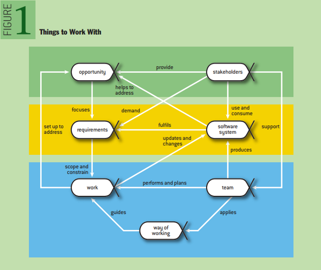

# [Clean Architecture](http://niquola.github.io/happydev-2013-slides/)

My slides for [happydev.2013](http://2013.happydev.ru)

### Что такое архитектура?

> Software Architecture as a Set of Architectural Design Decisions

[A. Jansen & J. Bosch](http://new.csd.uwo.ca/courses/CS4471b/secure/Additional%20Resources/020_Architectures.dir/1_WICSA_Confs/WICSA_2005_Pittsburgh/2005_papers/18500111.pdf)

### Решение это часто компромис

Умные люди знают, любое решение имеет обратную сторону (tradeoff)

У монеты две стороны; У палки два конца

* [CAP](http://ru.wikipedia.org/wiki/%D0%A2%D0%B5%D0%BE%D1%80%D0%B5%D0%BC%D0%B0_CAP) & Basically Available, Soft-state, Eventually consistent
* Простота и Гибкость
* Модульность и монолитность

### Это сокрыто в природе вещей

[Три закона диалектики](http://ru.wikipedia.org/wiki/%D0%97%D0%B0%D0%BA%D0%BE%D0%BD%D1%8B_%D1%84%D0%B8%D0%BB%D0%BE%D1%81%D0%BE%D1%84%D0%B8%D0%B8#.D0.92_.D0.B4.D0.B8.D0.B0.D0.BB.D0.B5.D0.BA.D1.82.D0.B8.D1.87.D0.B5.D1.81.D0.BA.D0.BE.D0.BC_.D0.BC.D0.B0.D1.82.D0.B5.D1.80.D0.B8.D0.B0.D0.BB.D0.B8.D0.B7.D0.BC.D0.B5)

*Закон единства и борьбы противоположностей*

> Движение и развитие в природе, обществе и мышлении
> обусловлено раздвоением единого на взаимопроникающие противоположности
> и разрешением возникающих противоречий между ними через борьбу

### Разница только в том насколько осознано вы выбираете

Иногда полезно использовать негативное определение
(ибо в порыве вдохновения о темной стороне часто забывают).

Хорошее решение уменьшает кол-во негативных последствий

>  Основная задача дизайна уменьшить боль, а не увеличить количество ништяков!
>  Нет хорошей или плохой архитектуры - она может быть обоснованной или нет!

[Тренинг «Проектирование обоснованной архитектуры», Евгений Кривошеев](http://jugru.timepad.ru/event/80808/)

### LEAN manufacturing (производственные концепции и практики Toyota)

  Идет по лесу циклоп. Тут навстречу ему медведь метётся. Циклоп:
  - Стоять! Кто такой?
  - Медведь.
  - Та-а-ак-сь. Так и запишем: МЕДВЕДЬ. Завтра придешь к моей пещере,
  я тебя буду есть. Вопросы есть?
  - Нету...- поник медведь.
  Циклоп идет дальше. Тут навстречу - волк:
  - Стоять! Кто такой?
  - Волк.
  - Та-а-ак-сь. Так и запишем: ВОЛК. Завтра придешь к моей пещере, я
  тебя буду есть. Вопросы есть?
  - Нету...- поник волк.
  Циклоп идет дальше. Тут навстречу - заяц:
  - Стоять! Кто такой?
  - Заяц.
  - Та-а-ак-сь. Так и запишем: ЗАЯЦ. Завтра придешь к моей пещере, я
  тебя буду есть. Вопросы есть?
  - А можно не приходить?
  - Та-а-ак-сь. Зайца вычеркиваем.

Делая выбор, порой забывают, что есть еще одна опция - "Отложить этот выбор"

> good architecture maximizes
> the number of decisions
> not made

Robert Martin (Uncle Bob)</h4>

### Архитектура не висит в воздухе

Мы часть бизнес-механизма, производящего ПО (see [SEMAT](http://semat.org/))

Свое подтверждение архитектура должна выводить из требований
Требования из бизнес модели



Принимающие архитектурные решения должны в достаточной степени понимать это.
Например некоторые противоречия могут быть разрешены только уровнем выше.

### System Thinking

Экспоненциальный рост сложности - взаимодействие частей!

Если вы создаете большую и сложную систему,
то надо ее разделять на подсистемы,
каждая из которых должна быть проще и содержать как можно меньше противоречий (SP)
и следить за зависимостями

> Design is taking things apart
> and then compose

[Rich Hickey](http://www.infoq.com/author/Rich-Hickey)

### DDD: Bounded Contexts & Aggregates

> Как правильно разрезать быка?
> По суставчикам

[Domain Driven Design] (http://en.wikipedia.org/wiki/Domain-driven_design) by [Eric Evans](http://www.infoq.com/author/Eric-Evans)

* Bounded Contexts
* Aggregates
* Entities & Value Objects


## Сложная предметная область
Если ваш контекст - сложная предметная область или неизвестность, то как быть

Что значит сложная?

Это когда для того чтобы с ней разобраться вам нужно затратить
столько же усилий и ресурсов, сколько вы например уже затратили на освоение IT.

Здесь вас поджидает ловушка - ПРЕЖДЕВРЕММЕННОЕ МОДЕЛИРОВАНИЕ!

> Преждевременная оптимизация — корень всех зол

Д. Кнут «Structured Programming with go to Statements»

### Behaviour Driven

С наружи важнее то как система себя ведет (внешние требования)
нежели то как она устроена (внутренние требования)

### Top-Down & Bottom-Up

Опять диалектика - Induction & Deduction

Вообще есть [два подхода](http://en.wikipedia.org/wiki/Top-down_and_bottom-up_design).

* Придумать модель и вывести приложение (скорость и магия, но большой риск)
* Вывести из приложения модель (низкий риск ошибки, но время и ресурсы)

Надо осознанно и своевременно пользоваться обоими по очередно.

Notes about RoR :)

### Как мы описываем систему - Use Case

Use Case -последовательность взаимодействий с системой направленная на достижение цели

Почему бы не отобразить Use Case прямо в код?

### Отображаем Use Case в код

```ruby

iam.tap do |s|
  confirmation_key = nil

  s.listen :sign_up do |ev|
    confirmation_key = ev.confirmation_key
  end

  s.sign_up!(email, password)
  s.confirm!(confirmation_key)

  session_key = s.sign_in!(email, password)
  s.session_active?(session_key).should be_true

  s.sign_out!(session_key)
end

```

### Итак: Use Case Driven

* Use Case - собираем и приоретизируем требования, проверяем их не противоричивость
* Prototype - делаем самую-самую дешевую реализацию и уточняем требование и наше понимание
* Specification - пишем автоматическую спецификацию
* Implementation - пишем работающую реализацию и заходим на второй цикл проверки
* Refactoring to deeper insight - когда находим правильную модель - рефакторим с тестами

### Закон Конвея & Кайдзен

